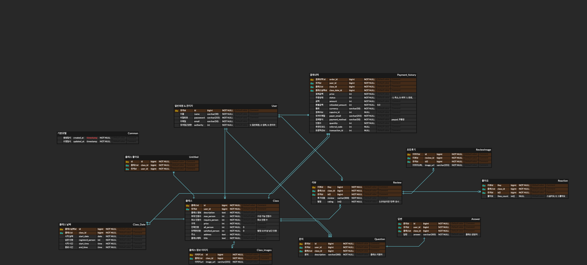
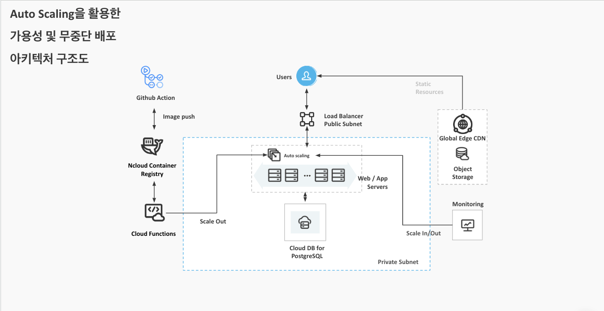

# oz_03_collabo-002-BE

합동 프로젝트 2팀 리포지토리입니다.

www.malazoo.kr

https://api.malazoo.kr/v1/schema/redoc

## ⚙️ 사용 기술

### BackEnd

## 🗓프로젝트 기간
-  **기본요구사항 : 24.08.06 ~ 24.09.09**

## 👤멤버 구성

### Team
|||
|:-:|:-:|
|[@im-niber](https://github.com/im-niber)|[@Gomnonix](https://github.com/Gomnonix)|

## 구현 기능
- 일일 클래스 정보 구현
- 클래스 예약 기능 구현
- 프로필 사진 변경, 닉네임 변경 및 소셜로그인 구현 
- 포토리뷰, 리뷰 좋아요, 즐겨찾기 클래스 기능 구현
- django admin 커스텀 기능 추가(최근 수정 내역 알림기능)
- 무중단 배포 및 CI 구현

## ERD

## Architecture

